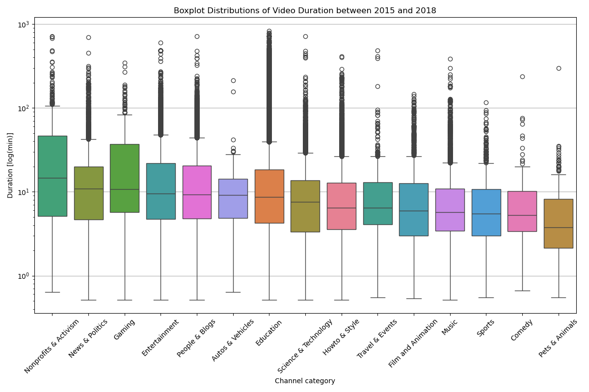
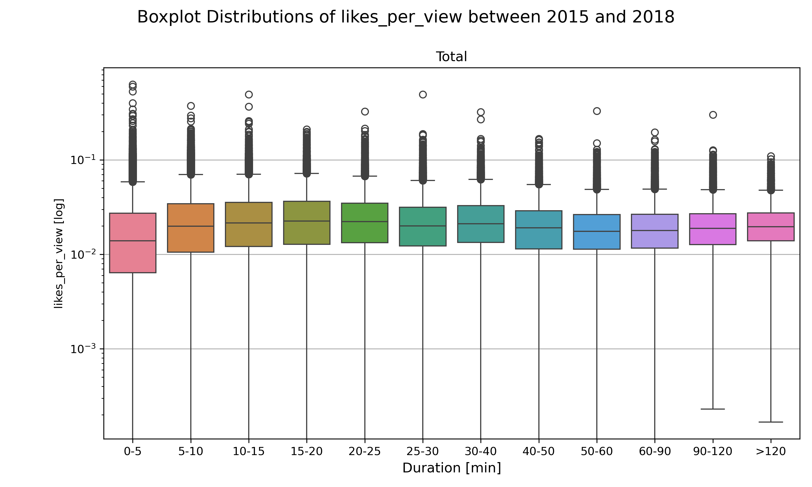
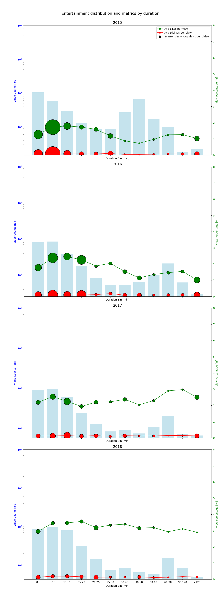
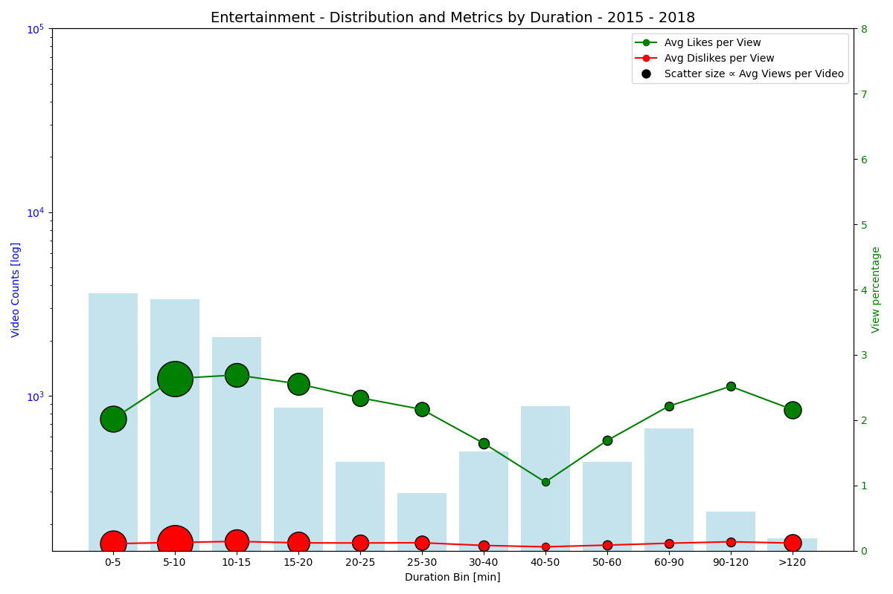
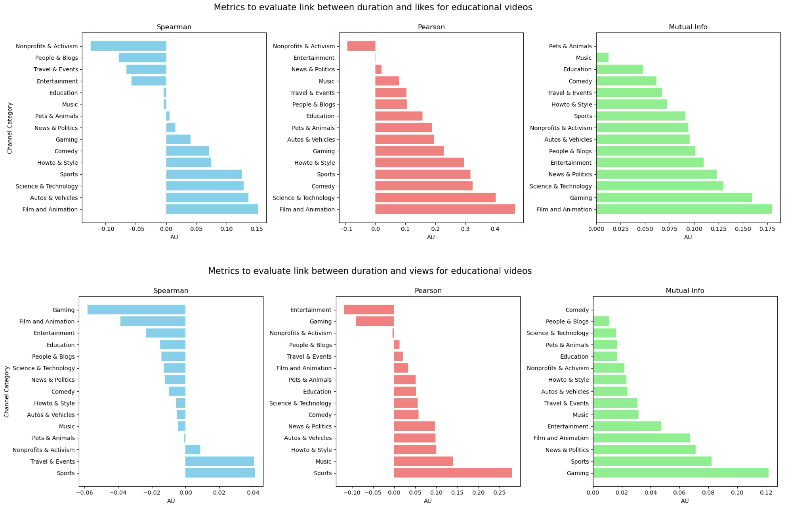

## **Introduction**
> It is not new information that video duration can play a critical role in video popularities on YouTube. But when it comes to educational content, many parameters come into play such as the category. Indeed one might prefer a short and concise tutorial on how to fix a door hinge, but desperately need an organic chemistry academic course to study before their exam, although both examples would have quite opposite durations.

---
### **Is there a difference in duration between categories?**

> *Figure 1: Duration distribution for videos categorized as educational by creator, clustered by category assigned to creator channel by socialblade*

We can see that video durations for published content across all categories show a classic long-tailed distribution, with dramatic outliers and whiskers stretching into marathon territory (think 100 minutes or much ( *much* ) more). 

Most videos, though, stay within a cozy IQR of 10–30 minutes — which seemed to be expected given general human attention span (keep in mind this was crawled before shorts make their appearance on the platform). 

Although there does not seem to be any major difference across categories, some outlisers for Gaming, Education and Entertainment could potentially come from niche content, such as live streams, academic lectures or episodic-like videos.

Meanwhile, some like Commedy and Pets & Animals stick to the shorter end of the spectrum, with low medians and shorter outliers —perfect for quick laughs or, let’s be honest, tutorials on how to sneak medicine into a pet’s food because that so hard!

### **Does duration of a video impact its engagement?**

In order to see how the popularity of a video could be impacted by its duration, we plotted boxplots representing distributions for various metrics (view count, likes and dislike per view). Additionally, we tried to plot multiple dimensions (we're big fans of the [Napoleon plot](https://ageofrevolution.org/200-object/flow-map-of-napoleons-invasion-of-russia/)) such as the video upload distribution, like and dislike per views and view count. You can see here a grand average and a specific category, but we plotted these for each and every category seen on Figure 1.

> *Figure 2: Likes-per-view percentage distribution for all videos categorized as educational by the creator, for various duration bins*

When it comes to the likes-per-view ratio across categories from 2015 to 2018 (Figure 2), some fascinating trends emerge. The median value hovers consistently around 2% across most categories and durations, but there’s an intriguing bimodal trend—peaks showing up for videos 10–15 minutes long and again for extended durations (40–60 minutes and beyond 120 minutes). This suggests viewers appreciate the snappiness of concise content but also recognize the effort and depth of longer videos. It would have been interesting to pair this with watch-time data (of we had it) to better interpret how duration ties into engagement.

Some standout categories include Nonprofits & Activism, People & Blogs, and Education, where the median likes-per-view ratio is higher regardless of video length, hinting at a more engaged audience. For longer videos, Film & Animation boasts high median and first-quartile ratios, likely reflecting in-depth or high-quality storytelling. On the other side, long Gaming videos show lower likes-per-view counts, or at least a lower firt quartile.

Plottin dislikes-per-view, Entertainment shows a dip in engagement for videos between 40–60 minutes, mirroring a similar trend in likes-per-view, while Gaming delivers a quirky bimodal curve, peaking at 0–15 minutes and 30–60 minutes but dropping off for longer content, keeping a high third-quartile. It’s curious, after sitting through 90+ minutes, you’d think people might have stronger opinions or at least enjoy the content!

    
    

    

> *Figure 3: Histogram representing educational video uploads for a given channel category (Here entertainment) over the years, as well as likes and dislikes per view in percentage. The size of the bubble represents the ammount of views per video on average for the given duration bin*

In Entertainment, 0–15 minute videos crushed it in 2015–2016 (with a sweet spot at 5–10 minutes) (Figure 3).
        News & Politics thrived in 2015–2017 with 15–40 minute videos, likely during major coverage events, and saw a spike in likes-per-view.
        Science & Tech had its big moment in 2018 with a surge in likes-per-view for 25–30 minute videos and massive views for 90–120 minute content.
        Pets & Animals? Always reliable. Giving a cat medicine is harder than one might think, and vet trips don’t come cheap, so those quick tutorials are pure gold.

> *Figure 4: Histogram representing educational video uploads for a given channel category (Here entertainment) as well as likes and dislikes per view in percentage. The size of the bubble represents the ammount of views per video on average for the given duration bin*

Over the four year period (Figure 4), Entertainment follows an “M-shaped” trend—peaks at 0–15 minutes and above 120 minutes, with a dip during 40–50 minutes where tons of videos were published. Gaming mirrors this M-curve too, while News & Politics gets solid views and engagement spikes for the longest content (120+ minutes). Who knew video analytics could tell such epic stories?

#### **How does duration impact its engagement?**
To understand better, let's have a look at a few mathematical tools to evaluate the link between the length and engagement for a given video.

> *Figure 5: Correlation and mutual information scores between duration and likes or views for educational videos based on the category of their owner channel*

When it comes to video duration and popularity, the Spearman, Pearson, and Mutual Information metrics show how different genres play by their own rules. Turns out, video duration isn’t a one-size-fits-all ingredient for success—it hits differently depending on the category.

Spearman and Pearson correlations tell us that in many cases, video duration doesn’t have a strong linear relationship with likes or views. 

In genres like Nonprofits & Activism or People & Blogs, negative correlations pop up, hinting that brevity might be the way to go.

On the opposite, categories like Film & Animation, Science & Tech, and Gaming show positive correlations, suggesting that longer videos might actually deliver what their audiences crave —be it depth, storytelling, or a gamer’s epic boss fight.

Mutual Information spills the tea on non-linear relationships. Higher scores in Gaming, Film & Animation, and Science & Tech indicate that duration plays a more nuanced and complex role here. While the scores are still relatively low, they suggest that some genres thrive when the content fits “just right”.

#### **Likes vs. Views: Engagement Wins the Battle**
Duration seems to have a bigger impact on likes than views. Spearman, Pearson, and even Mutual Information all agree: video length has more sway over how much people appreciate a video rather than how many eyeballs it attracts. Maybe it’s the effort of hitting that like button?

Film & Animation, Science & Tech, and Gaming: These categories thrive on well-executed, often longer videos. Give the audience what they came for, and they’ll reward you.
Nonprofits & Activism, People & Blogs: Here, shorter is sweeter—viewers might prefer concise, impactful content.

Duration’s impact is anything but simple, and clearly, YouTube’s an ecosystem of its own.

---
### **So what CAN we say?**

Video duration on YouTube educational content is far from a simple "longer is better" or "shorter is sweeter" rule, it’s a topic-specific balancing act. While most videos fall into the comfortable 10–30 minute range, niche categories thrive on breaking these norms.

Purely educational channels, Gaming, Film & Animation, and Science & Tech audiences reward depth and effort, appreciating longer, well-crafted videos. On the contrary, brevity is king in categories like Nonprofits & Activism or People & Blogs, where concise, impactful storytelling resonates more and viewers can quickly get the information they sought.

Interestingly, duration’s influence leans more toward engagement (likes) than pure viewership. Longer videos might not always attract more viewers, but they clearly resonate with those who stick around, earning higher appreciation.

---
