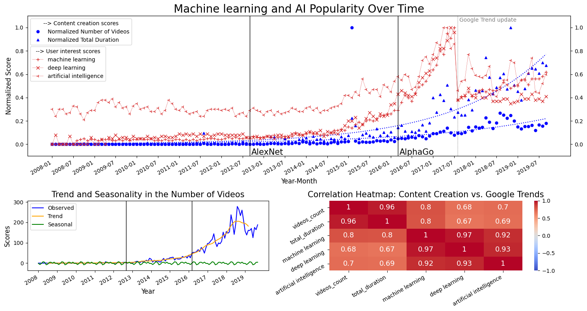
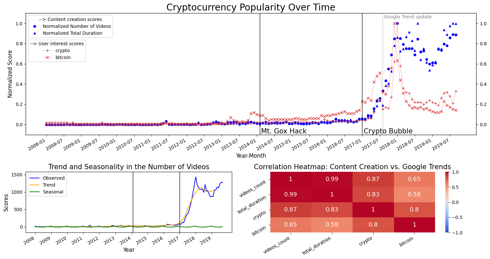
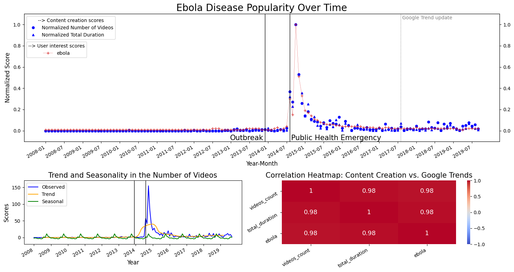
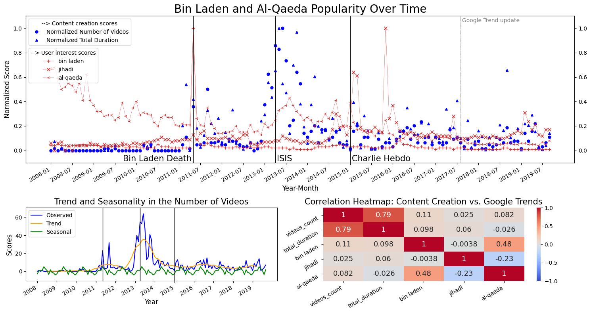
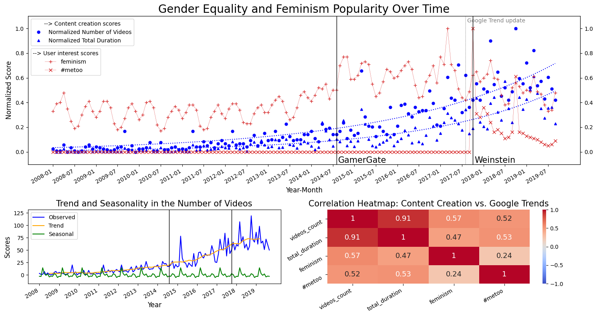

Why do some topics ignite bursts of interest and fade away immediatly, while others foster sustained engagement and content creation? Does YouTube, through its educational content, serve as a reactive platform, mirroring societal buzz, or does it have the power to shape and sustain public discourse over time? From cryptocurrency booms to feminist movements, we aim to uncover patterns of attention, reaction, and even neglect. 

## **Methodology - The Best Wrap Recipe**
Inspired by the iconics YouTube Rewind and Spotify Wrapped, our "YouTube Wrapped" unpacks an entire era of YouTube history, from 2008 to 2019. Instead of highlighting viral moments from a specific year, this wrap dives into the platform's evolution across key cultural and societal events, with a close look at public interest and content creation. 

We analyzed YouTube's history of educational content by focusing on five major topics: machine learning, cryptocurrency, Ebola disease, jihadism, and the feminist movement, exploring the intersection of content creation and audience interest. Through simple keyword searches, we focus our attention on videos tied to these subjects. In each case, we compare the volume of videos (blue) to the YouTube search trends from Google Trends (red). Beyond these time-series comparisons, we analyze global trends and seasonal fluctuations in video production, as well as correlations between user interest and content creation.

>*Please note that Google Trend updated their data collection system on 05/08/2017 which can induce some inconsistencies in YouTube search trends (red curves of "user interest").*

---

### **Case #1: 'Golden Ratio' Wrap**

Our first case study is related to machine learning and artificial intelligence advances. Content creation (in blue) shows a study growth until 2016, after which it exponentially rise. Could it be related to AlphaGo, the first program that beat a human professional Go player? In any case, AI captured mainstream attention around that time, as depicted by the search trends (in red) that are highly correlated with the amount of videos posted at that time. Also, you may have noticed a steady trend in both content creation and user interest in 2019, but don't worry it will rise again a few years later with the arrival of ChatGPT...

*Fun fact: the channel Udacity posted approximately 1000 videos in February 2015, all more or less related to datascience, machine learning, and excel101, explaining the lonely blue dot at that date.*

---

### **Case #2: 'Fool's Gold' Wrap**

The second case study dives into cryptocurrencies. Content creation remained nearly flat until 2017, and skyrocketed in sync with the Crypto Bubble, comprising the 2017 boom and the 2018 crash. Interestingely, content creators showed remarkable persistence, steadily producing content (blue) despite the fading audience curiosity (red). Overall, the data paints a vivid picture of how cryptocurrency hype and dramatic market events drive a reactive surge in both user interest and content production on YouTube.

---

### **Case #3: 'Forecast' Wrap**

This third case tackles the Ebola virus. Both content creation and searches exhibit a sharp spike during the 2014 outbreak, and decline steeply afterward. Please note that the seasonality effect observed in the bottom left plot is due to this sudden peak of attention. If governments and the public had shown sustained interest in pandemic preparedness back then, we may have prevented all the 2020 drama... (#covid)

---

### **Case #4: 'Trouble Maker' Wrap**

In the fourth case, we take a look at Jihadism. This case is a bit more chaotic than the others... Overall, while geopolitical and historical events seem to trigger the user's curiosity "on the moment", content creation seem more distributed over time and doesn't really follow public interest (low correlations) or major events. While previous cases highlighted the dataset ability to capture the reactive nature of video creation (in response to momentary spikes in attention), it fails to address broader dynamics. 

---

### **Case #5: 'Ladies First' Wrap**

And finally, feminism, because as always, women somehow end up at the back of the line. We observe that user interest in feminism-related educational content exhibits steady fluctuations with occasional peaks over time. Content creation, in contrast, shows a steady exponential trend. In both case, there is a clear seasonal effect peaking in March (likely linked to the international women's day on March 8th). Surprisingly, the #MeToo movement after the Weinstein scandal did not generate an immediate increase in content volume, but as in the previous case, there might be a broader impact on the long run.

---

## **Conclusion**
This YouTube wrap reveals how the platform mirrors societal trends, with content creation often reacting to spikes in public interest driven by major events. While some topics, like machine learning and feminism, sustain steady creator engagement, others, like Ebola, may show bursts of attention that quickly fade.

