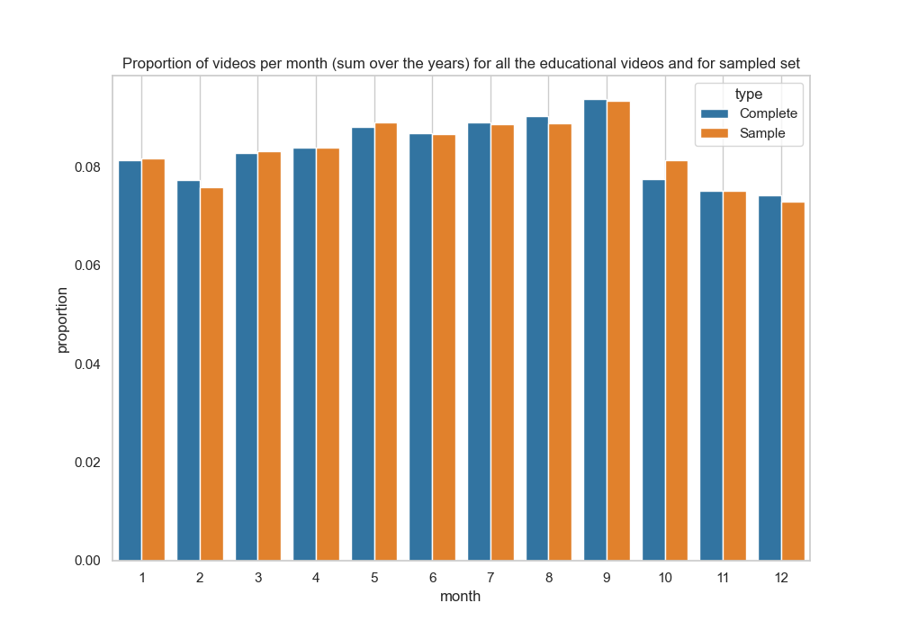

One of our main motivation for this analyis comes from our own experience as students using Youtube. The ability to watch videos that complement lectures and have concepts clearly explained rather than scrolling through endless Wikipedia pages has truly been a game changer. The platform has become an unofficial teaching assistant, guiding us through everything from calculus proofs to developing a website. This got us thinking: are there certain times of the year when educational content becomes even more popular? Maybe during exam seasons, when students worlwide are trying to cram an entire semester’s worth of concepts into a single night. With this analysis, we set out to uncover whether there’s a seasonal rhythm to the upload and consumption of educational content.

## **What is the best time to upload videos**
To be able to differentiate between multiple type of educational content, we classified the videos using BART, a natural language processing model capable of performing sentiment analysis. We used a sample of 50000 "Educational" videos into 3 categories: 'academic', 'edutainement or science popularization' and 'hobby'.

Let's see if there is a seasonality in uploads for academic-type videos

  <iframe src="assets/plots/academic_videos_per_month_by_year.html" width="100%" height="500" frameborder="0"></iframe>

By looking at this plot, we could think that there is a peak of uploads in September. This would confirm the idea that academic-type content is most used during the school year, and here particularly at the start of the schoolyear. 

    

        As this specific pattern could be due to the distribution of the videos per month on the whole dataset.
        To be sure that our distribution is significant, we perform a chi-square goodness of fit test. This tests the null hypothesis that the categorical data has the given frequencies.
    

    

We obtain a p-value of 4.062e-07, strongly rejecting the null hypothesis. However, by analyzing more in details, we notice than this pattern is not present for every year. The peak in September is in fact mostly due to the years 2015, 2017 and 2018. We then performed chi-square the same chi squared test for every year. We obtain that the p-values falling under the threshold of 0.005 are in fact 2015, 2017 and 2018. We then cannot extrapolate that there is a real seasonality for other than the these year.

> *Note: we set the confidence threshold at 0.005 because we perform 10 statistical tests, the propoability of a p-value falling under the threshold of 0.05 is then 10 times higher*

Let's do the same analysis for the edutainment-type videos

  <iframe src="assets/plots/edutainment_videos_per_month_by_year.html" width="100%" height="500" frameborder="0"></iframe>

Performing the same tests as for the academic videos, we find that the only year with a different distribution than the original distribution is the year 2018 and the observed peak is in July. These tests allows us to say that there is very little if not seasonality for the edutainment-type videos.

## **What about the famous "Academic" channels**
Analyzing the time series would give us more insight about the viewers's consumption habits. To do this, we can plot the delta views per weeks of a famous youtube channels posting mainly academic-type content. Let's look at Bozeman Science statistics for the year 2018.

  <iframe src="assets/plots/stats_channel_Bozeman Science_2018.html" width="100%" height="500" frameborder="0"></iframe>

We observe a noticeable drop in viewership during the summer months, followed by peaks just before and after the summer break. Interestingly, even though this channel didn't release any new videos in 2018, the viewership still followed this distinct pattern, suggesting that people actively seek out older videos during this time.

While there is some evidence of seasonal trends in the upload and consumption of educational content, particularly around the school year for academic videos, the patterns are not consistent across all years or content types. Interestingly, the edutainment videos did not show strong evidence of seasonality suggesting that audiences consistently seek accessible and engaging information at all time !