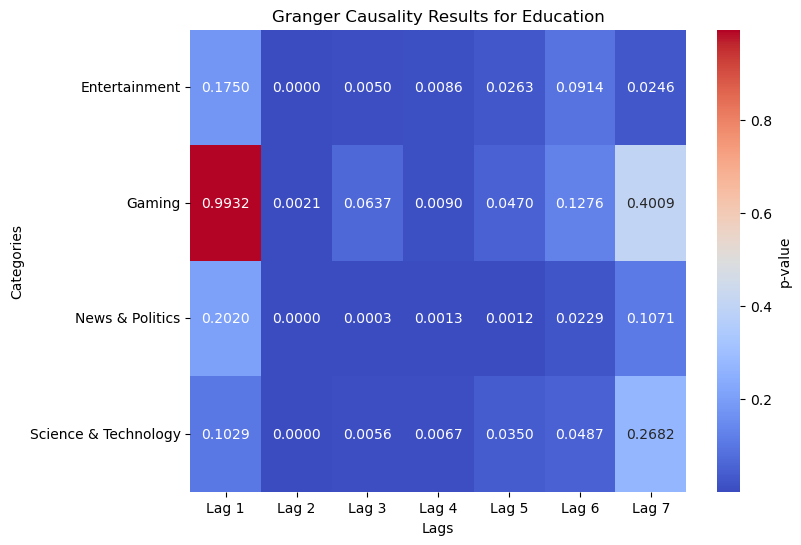

## **Introduction**

"Who is controlling the information?" This section deeps dive into the influence of content creation across various categories on YouTube over time. By examining how a topic shape and interact with content in diverse categories, we aim to uncover the underlying dynamics of information spread on the platform.

## **Method**

The analysis introduced here, focuses on one topic: Data Science. This study utilizes a pipeline developed in the `spread.ipynb` notebook. First,it extracts videos from the original YouNiverse dataset -not limited to educational content- but spans a broad range of categories available to the authors on the platform.

The extraction process focuses on specific keywords search within video titles and tags to ensure exclusivity and relevance. In this case, keywords such as 'machine learning', 'deep learning', and 'artificial intelligence'.

Following extraction, subsequent preprocessing steps produce a pandas DataFrame containing monthly time series data, reflecting the number of videos created within these selected categories. Given the vast amount of data available, the analysis focuses on the top categories that collectively account for the majority (typically 90%) of the dataset. This approach ensures that resulting visualizations and analyses remain comprehensible, limited to scalable categories, and based on sufficient data to support meaningful causal investigations.

The study period spans from 2015 to 2018, chosen due to the relatively low volume of data prior to 2015 and the exclusion of the final month of 2019 to avoid seasonality effects that could lead to misleading results.

To refine the analysis, metrics such as the noise-to-signal ratio (SNR), and autocorrelation at lag one are employed. These metrics help determine the optimal monthly basis aggregation level for capturing local insights.

Finally, analytical methods such as Dynamic Time Warping (DTW) and Granger causality are applied to examine the influence of content creation in Education on other categories over time.

### **Monthly Basis Aggregation**

    

        
    

    

        
    

A 2 months aggregation level was selected as it features high Signal-to-Noise Ratio (SNR) and autocorrelation at lag 1. This ensures aggregation effectively filters noise, and preserve temporal structure without excessive smoothing.

## **Results**

### **Dynamic Time Warping**

Dynamic Time Warping (DTW) enables the alignment of sequences based on their similarity. By analyzing content creation patterns within a defined time frame, we can gain deeper insights into how external influences in one category contribute to the development of trends in another [1]. This helps uncover patterns of influence and adaptation over time.

To address variations in scale, standardizing the time series is essential. Additionally, incorporating a rolling time window to capture local variance within the series is beneficial. We selected a rolling window size of 4 units (one year) based on a 2-month aggregation level of the time series. This choice aligns with natural annual cycles, capturing seasonality and periodic trends inherent in the data.

### **Granger Causality Test**

    

Granger causality is a statistical method used to determine if one time series can predict another. If past values of one time series contribute to the prediction of another, it indicates that the first series Granger-causes the second.

The process of Granger causality involves testing the null hypothesis that past values of the independent variable do not add significant predictive power to the dependent variable. By including lagged values in a regression model, the test evaluates whether the past values of one series provide additional information beyond what is explained by the dependent variable alone. If the null hypothesis is rejected, it suggests a causal relationship between the two series, where past changes in one category influence the evolution of another.

## **Discussion**

Initially, from 2015 to early 2016, the normalized DTW distances across all categories -except "Gaming"- were relatively low, indicating a shared upward trend in content creation (1). This trend likely reflects a platform-wide increase in video production and content experimentation across categories. As time progressed, the DTW distances diverged, illustrating the specialization of trends. For instance, the DTW distance between "Education" and "Gaming" grew steadily after 2016, surpassing all other categories by mid-2018. This suggests that gaming content followed its own unique trajectory, largely unaffected by trends in educational videos. In contrast, "Science & Technology" consistently exhibited a low DTW distance with "Education" throughout the time period. This alignment likely stems from their shared focus on technological advancements, as well as overlapping audiences.

The influence of major events on these trends is also apparent. For example, the alignment between "Education" and "Science & Technology" intensified following the open-sourcing of TensorFlow in late 2015 and the release of TensorFlow 1.0.0 in early 2017. These milestones coincided with spikes in educational content related to machine learning, as creators responded to increased interest in these tools. Similarly, "News & Politics" exhibited periodic alignment with "Education," possibly reflecting moments when societal discussions around AI ethics, automation, and data privacy gained traction.

The Granger causality analysis further elucidates the relationships between "Education" and other categories, offering statistical evidence of causal influences. As shown in the heatmap, "Science & Technology" demonstrates strong causality with "Education" across multiple lags, with particularly low p-values (<0.01) at lags 2 through 4. This indicates that past trends in "Science & Technology" content significantly contributed to the growth of educational videos. The causal relationship may reflect the ripple effect of technological breakthroughs, where innovations prompt the creation of explanatory content to address audience curiosity and demand. "News & Politics" also exhibits strong causality with "Education," particularly at shorter lags (lags 2 and 3, with p-values <0.001). This relationship highlights the influence of media coverage and public discourse on educational content creation.

## **Conclusion**

The low DTW distances between "Education" and "Science & Technology" suggest a strong alignment driven by shared technological milestones. The Granger causality analysis confirms that both "Science & Technology" and "News & Politics" exert significant influence on educational content creation.

### **References**

- [1] Keogh, E. J., & Pazzani, M. J. (2001). Scaling up Dynamic Time Warping to Massive Datasets. *Department of Information and Computer Science, University of California, Irvine*. Retrieved from {eamonn, pazzani}@ics.uci.edu.

- [2] Barjasteh, I., Liu, Y., & Radha, H. (2014). Trending Videos: Measurement and Analysis. arXiv:1409.7733 [cs.SI]. https://doi.org/10.48550/arXiv.1409.7733

- [3] Krishnamurthy, V., & Duan, Y. (2017). Dependence Structure Analysis Of Meta-level Metrics in YouTube Videos: A Vine Copula Approach. arXiv:1712.10232 [cs.SI]. https://doi.org/10.48550/arXiv.1712.10232

---

(1): The peak in content creation for the "Education" category in February 2015 can be attributed to a single channel that uploaded numerous Excel tutorials. These videos were likely transferred from another channel and tagged with "machine learning" or "artificial intelligence" in their descriptions. This raises concerns about the accuracy of the classification made by the authors.
