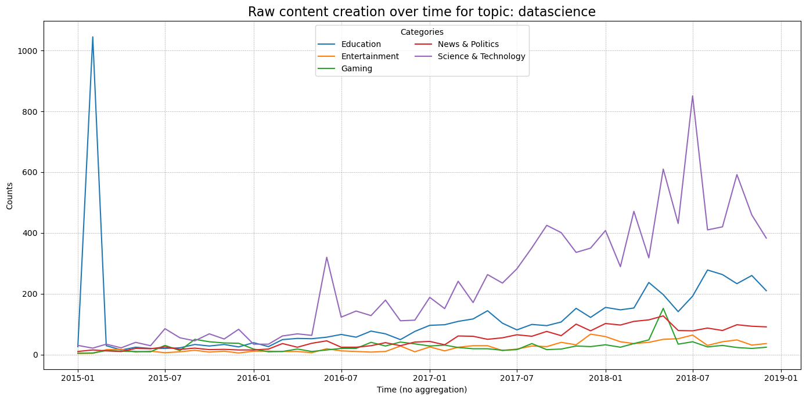
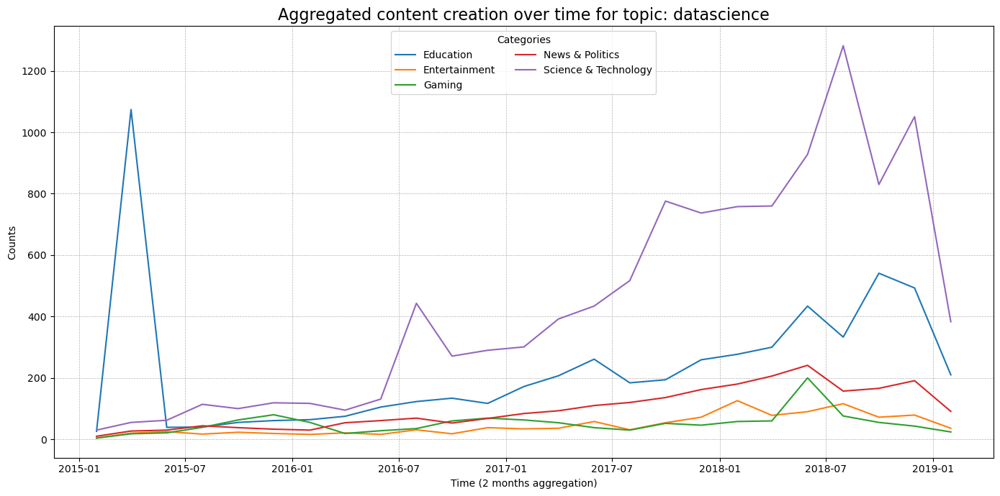
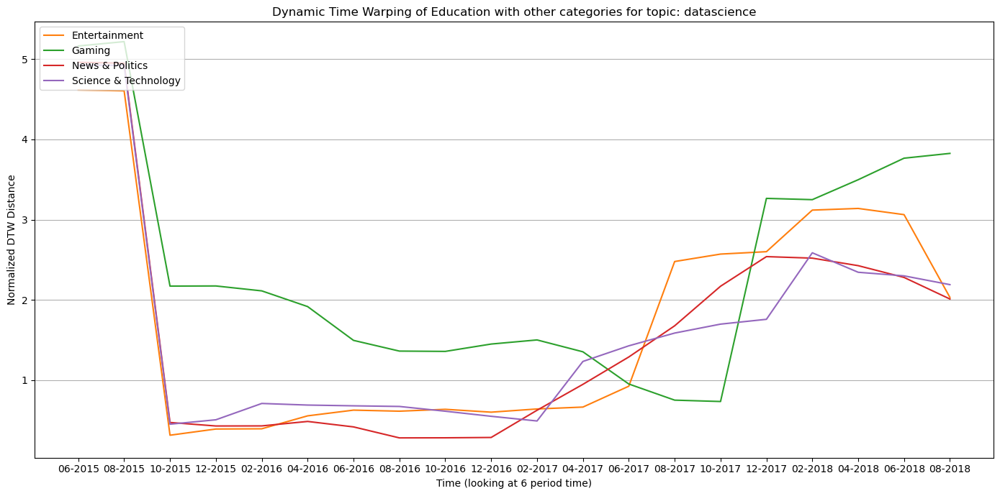

## **Introduction**

"Who is controlling the information?" This section deeps dive into the influence of content creation across various categories on YouTube over time. By examining how a topic shape and interact with content in diverse categories, we aim to uncover the underlying dynamics of information spread on the platform.

## **Method**

The analysis introduced here, focuses on one topic: Data Science. This study utilizes a pipeline developed in the `spread.ipynb` notebook. First,it extracts videos from the original YouNiverse dataset -not limited to educational content- but spans a broad range of categories available to the authors on the platform.

The extraction process focuses on specific keywords search within video titles and tags to ensure exclusivity and relevance. In this case, keywords such as 'machine learning', 'deep learning', and 'artificial intelligence'.

Following extraction, subsequent preprocessing steps produce a pandas DataFrame containing monthly time series data, reflecting the number of videos created within these selected categories. Given the vast amount of data available, the analysis focuses on the top categories that collectively account for the majority (typically 90%) of the dataset. This approach ensures that resulting visualizations and analyses remain comprehensible, limited to scalable categories, and based on sufficient data to support meaningful causal investigations.

The study period spans from 2015 to 2018, chosen due to the relatively low volume of data prior to 2015 and the exclusion of the final month of 2019 to avoid seasonality effects that could lead to misleading results.

To refine the analysis, metrics such as the noise-to-signal ratio (SNR), and autocorrelation at lag one are employed. These metrics help determine the optimal monthly basis aggregation level for capturing local insights.

Finally, analytical methods such as Dynamic Time Warping (DTW) and Granger causality are applied to examine the influence of content creation in Education on other categories over time.

## **Monthly Basis Aggregation**

    

        
    

    

        
    

A 2 months aggregation level was selected as it features high Signal-to-Noise Ratio (SNR) and autocorrelation at lag 1. This ensures aggregation effectively filters noise, and preserve temporal structure without excessive smoothing.

The major events about the topic taht fall between these series: 
- November 2015: Google open-sourced TensorFlow, its machine learning framework, significantly advancing AI and machine learning research and applications.
- February 2017: The release of TensorFlow 1.0.0 marked a milestone in machine learning development.

> *Figure 1: Sales trends across quarters.*

Dynamic Time Warping (DTW) is a powerful method for studying the influence of content creation across different categories on platforms like YouTube. In this context, the use of DTW allows for a nuanced analysis of how content in one category can impact another over time, even when they exhibit different temporal scales. To address the variations in scale and focus on meaningful insights, normalisation of the time series is essential. By standardising the data, we ensure that comparisons between categories are based on relative patterns rather than absolute values, allowing for a more accurate analysis of peak translations and the influence of content creation across different periods.

In addition to normalisation, a critical component of this analysis is the use of a time window to capture local variance within the time series. Specifically, a 3-month time window is employed to focus on shorter-term trends and changes rather than relying on the full extent of the available data. This approach helps to highlight more recent patterns, offering insights into how content creation evolves over time within distinct categories. By narrowing the scope, we are able to capture dynamic shifts in content creation, reflecting how certain trends influence others in specific intervals, thereby providing a clearer understanding of cross-category interactions.

Dynamic Time Warping, with its flexibility in handling non-linear transformations and temporal shifts, is well-suited to this analysis. Its ability to align sequences based on similarity, even with varying lengths and patterns, makes it an ideal tool for studying the evolving relationships between different content categories. Additionally, by examining content creation patterns within this defined time frame, we can gain deeper insights into how external influences from one category contribute to the development of trends in another, helping to uncover patterns of influence and adaptation over time.

[1] Keogh, E. J., & Pazzani, M. J. (2001). Scaling up Dynamic Time Warping to Massive Datasets. *Department of Information and Computer Science, University of California, Irvine*. Retrieved from {eamonn, pazzani}@ics.uci.edu.

---
We selected a rolling window size of 4 units (one year) based on the 3-month aggregation level of the time series. This choice aligns with natural annual cycles, capturing seasonality and periodic trends inherent in the data. A one-year window balances local variability and long-term patterns, ensuring that the rolling DTW distances reflect meaningful temporal dynamics while minimizing noise, making the results both robust and interpretable.

---

## **References**

- [1] Keogh, E. J., & Pazzani, M. J. (2001). Scaling up Dynamic Time Warping to Massive Datasets. *Department of Information and Computer Science, University of California, Irvine*. Retrieved from {eamonn, pazzani}@ics.uci.edu.

- [2] Barjasteh, I., Liu, Y., & Radha, H. (2014). Trending Videos: Measurement and Analysis. arXiv:1409.7733 [cs.SI]. https://doi.org/10.48550/arXiv.1409.7733

- [3] Krishnamurthy, V., & Duan, Y. (2017). Dependence Structure Analysis Of Meta-level Metrics in YouTube Videos: A Vine Copula Approach. arXiv:1712.10232 [cs.SI]. https://doi.org/10.48550/arXiv.1712.10232

---

*Thank you for reading! Feel free to reach out for further information or collaboration opportunities.*

---

## **Key Findings**
### **Top Insights:**
- **Sales Growth:** Sales increased by **25%** in Q3 compared to Q2.
- **Product Performance:** **Product A** outperformed others in urban markets.
- **Web Traffic:** Website traffic surged following the new marketing campaign.

> Use **bold text** for key points and *italics* for clarifications.

---

## **Visual Insights**
### **Centered Image**

> *Figure 1: Sales trends across quarters.*

---

### **Image with Text Alignment**
#### Image to the Left

    
    

        **Observation:** *Product A demonstrated remarkable performance in urban markets during the campaign. This suggests a need to further target similar demographics for sustained growth.*
    

---

#### Image to the Right

    

        **Insight:** *Website traffic surged after the new campaign launch, highlighting strong audience engagement. Future campaigns can capitalize on this trend to drive conversions.*
    

    

---

## **Deep Dive Analysis**
Break down each key finding with deeper analysis, supported by visuals and data tables.

### **Sales Analysis**
- **Observation:** The highest sales occurred in **July**, driven by a summer promotion.
- **Details:** The promotion contributed to a **50% growth rate** in sales.

| Month      | Sales ($)   | Growth Rate |
|------------|-------------|-------------|
| June       | 10,000      | +5%         |
| July       | 15,000      | +50%        |
| August     | 12,000      | -20%        |

> *July's promotion was highly successful, but August showed a decline, indicating the need for follow-up strategies.*

---

## **Interactive Plotly Visualization**
Below is an interactive Plotly chart embedded directly into this Markdown file using HTML:

  <iframe src="assets/plot.html" width="100%" height="500" frameborder="0"></iframe>
  
Figure 1: Dummy Plotly Chart

### **Plotly Chart with Text on the Right**

  <!-- Plot -->
  

    <iframe src="assets/plot.html" width="100%" height="500" frameborder="0"></iframe>
  

  <!-- Text -->
  

    <h3>Insights</h3>
    

      This Plotly chart highlights the performance of various categories over time. Use it to analyze trends and identify key areas for improvement or further study.
    

    

      The data indicates significant growth in Q3, with certain categories outperforming others due to targeted strategies.
    

  

---

### **Plotly Chart with Text on the Left**

  <!-- Text -->
  

    <h3>Analysis</h3>
    

      This visualization compares multiple metrics across different months. It reveals seasonal trends and helps in understanding variations in performance across quarters.
    

    

      The results emphasize the importance of summer promotions and their impact on overall sales growth.
    

  

  <!-- Plot -->
  

    <iframe src="assets/plot.html" width="100%" height="500" frameborder="0"></iframe>
  

---

## **Embedded Videos**
You can embed videos directly into your report using HTML. For example:

### **Marketing Campaign Video**

  <iframe
    width="560"
    height="315"
    src="https://www.youtube.com/embed/tiEPzEp2T4A"
    frameborder="0"
    allow="accelerometer; autoplay; clipboard-write; encrypted-media; gyroscope; picture-in-picture"
    allowfullscreen
  ></iframe>

Figure 3: Overview of our marketing campaign strategy.

---

## **Conclusions**
> *In summary, our analysis shows that targeted promotions in urban areas drive significant sales growth. However, maintaining momentum after campaigns remains a challenge.*

---

## **Next Steps and Recommendations**
### **Actionable Recommendations:**
1. Launch a **follow-up campaign** in **August** to sustain sales momentum.
2. Focus on urban markets for **Product A**, as they demonstrate the highest potential.
3. Leverage website analytics to identify trends and optimize future marketing campaigns.

---

## **Additional Notes**
- **Dataset:** [View Dataset](https://github.com/epfl-dlab/YouNiverse)
- **Tools Used:** *Python, pandas, Matplotlib*
- **References:** Internal sales records and web traffic data.

---

*Thank you for reading! Feel free to reach out for further information or collaboration opportunities.*
