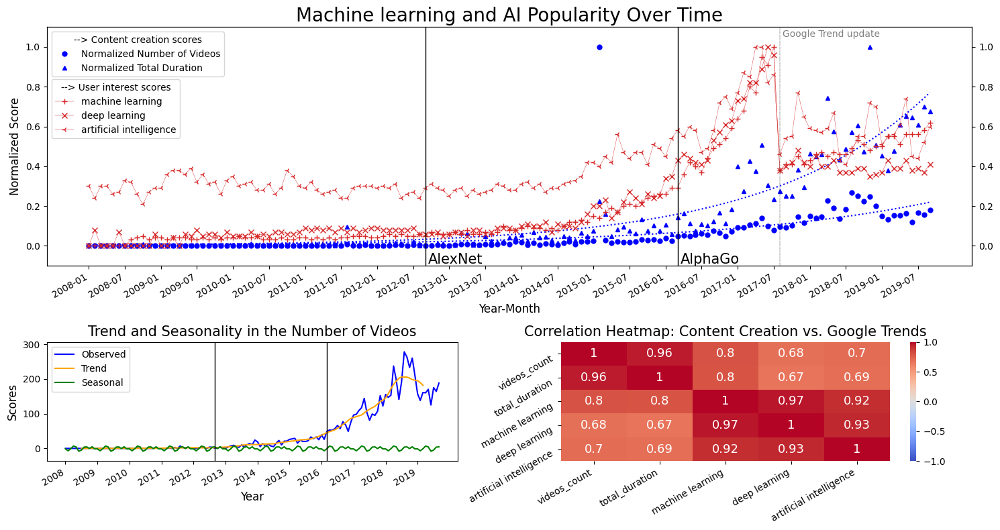

Why do some topics ignite bursts of interest and fade away immediatly, while others foster sustained engagement and content creation? Does YouTube, through its educational content, serve as a reactive platform, mirroring societal buzz, or does it have the power to shape and sustain public discourse over time? From cryptocurrency booms to feminist movements, we aim to uncover patterns of attention, reaction, and even neglect. 

## **Methodology - The Best Wrap Recipe**
Inspired by the iconics YouTube Rewind and Spotify Wrapped, our "YouTube Wrapped" unpacks an entire era of YouTube history, from 2008 to 2019. Instead of highlighting viral moments from a specific year, this wrap dives into the platform's evolution across key cultural and societal events, with a close look at public interest and content creation. 

We analyzed YouTube's history of educational content by focusing on five major topics: machine learning, cryptocurrency, Ebola disease, jihadism, and the feminist movement, exploring the intersection of content creation and audience interest. Through simple keyword searches, we focus our attention on videos tied to these subjects. In each case, we compare the volume of videos (blue) to the YouTube search trends from Google Trends (red). Beyond these time-series comparisons, we analyze global trends and seasonal fluctuations in video production, as well as correlations between user interest and content creation.

>*Please note that Google Trend updated their data collection system on 05/08/2017 which can induce some inconsistencies in YouTube search trends (red curves of "user interest").*

### **Case #1: 'Golden Ratio' Wrap**

Our first case study is related to machine learning and artificial intelligence advances. Content creation (in blue) shows a study growth until 2016, after which it exponentially rise. Could it be related to AlphaGo, the first program that beat a human professional Go player? In any case, AI captured mainstream attention around that time, as depicted by the search trends (in red) that are highly correlated with the amount of videos posted at that time. Also, you may have noticed a steady trend in both content creation and user interest in 2019, but don't worry it will rise again a few years later with the arrival of ChatGPT...

*Fun fact: the channel Udacity posted approximately 1000 videos in February 2015, all more or less related to datascience, machine learning, and excel101, explaining the lonely blue dot at that date.*

### **Case #2: 'Fool's Gold' Wrap**

The second case study is related to cryptocurrencies. Content creation remained nearly flat until 2017, and skyrocketed in sync with the Crypto Bubble, comprising the 2017 boom and the 2018 crash. Interestingely, content creators showed remarkable persistence, steadily producing content (blue) despite the fading audience curiosity (red). Overall, the data paints a vivid picture of how cryptocurrency hype and dramatic market events drive a reactive surge in both user interest and content production on YouTube.

### **Case #3: 'Forecast' Wrap**

This third case tackles the Ebola virus. Both content creation and searches exhibit a sharp spike during the 2014 outbreak, and decline steeply afterward. Please note that the seasonality effect observed in the bottom left plot is due to this sudden peak. If the population and government showed long-term engagement on the "pandemia" topic, we may have prevented all the 2020 drama (#covid).

---

## **Visual Insights**
### **Centered Image**

> *Figure 1: Sales trends across quarters.*

---

### **Image with Text Alignment**
#### Image to the Left

    
    

        **Observation:** *Product A demonstrated remarkable performance in urban markets during the campaign. This suggests a need to further target similar demographics for sustained growth.*
    

---

#### Image to the Right

    

        **Insight:** *Website traffic surged after the new campaign launch, highlighting strong audience engagement. Future campaigns can capitalize on this trend to drive conversions.*
    

    

---

## **Deep Dive Analysis**
Break down each key finding with deeper analysis, supported by visuals and data tables.

### **Sales Analysis**
- **Observation:** The highest sales occurred in **July**, driven by a summer promotion.
- **Details:** The promotion contributed to a **50% growth rate** in sales.

| Month      | Sales ($)   | Growth Rate |
|------------|-------------|-------------|
| June       | 10,000      | +5%         |
| July       | 15,000      | +50%        |
| August     | 12,000      | -20%        |

> *July's promotion was highly successful, but August showed a decline, indicating the need for follow-up strategies.*

---

## **Interactive Plotly Visualization**
Below is an interactive Plotly chart embedded directly into this Markdown file using HTML:

  <iframe src="assets/plot.html" width="100%" height="500" frameborder="0"></iframe>
  
Figure 1: Dummy Plotly Chart

### **Plotly Chart with Text on the Right**

  <!-- Plot -->
  

    <iframe src="assets/plot.html" width="100%" height="500" frameborder="0"></iframe>
  

  <!-- Text -->
  

    <h3>Insights</h3>
    

      This Plotly chart highlights the performance of various categories over time. Use it to analyze trends and identify key areas for improvement or further study.
    

    

      The data indicates significant growth in Q3, with certain categories outperforming others due to targeted strategies.
    

  

---

### **Plotly Chart with Text on the Left**

  <!-- Text -->
  

    <h3>Analysis</h3>
    

      This visualization compares multiple metrics across different months. It reveals seasonal trends and helps in understanding variations in performance across quarters.
    

    

      The results emphasize the importance of summer promotions and their impact on overall sales growth.
    

  

  <!-- Plot -->
  

    <iframe src="assets/plot.html" width="100%" height="500" frameborder="0"></iframe>
  

---

## **Embedded Videos**
You can embed videos directly into your report using HTML. For example:

### **Marketing Campaign Video**

  <iframe
    width="560"
    height="315"
    src="https://www.youtube.com/embed/tiEPzEp2T4A"
    frameborder="0"
    allow="accelerometer; autoplay; clipboard-write; encrypted-media; gyroscope; picture-in-picture"
    allowfullscreen
  ></iframe>

Figure 3: Overview of our marketing campaign strategy.

---

## **Conclusions**
> *In summary, our analysis shows that targeted promotions in urban areas drive significant sales growth. However, maintaining momentum after campaigns remains a challenge.*

---

## **Next Steps and Recommendations**
### **Actionable Recommendations:**
1. Launch a **follow-up campaign** in **August** to sustain sales momentum.
2. Focus on urban markets for **Product A**, as they demonstrate the highest potential.
3. Leverage website analytics to identify trends and optimize future marketing campaigns.

---

## **Additional Notes**
- **Dataset:** [View Dataset](https://github.com/epfl-dlab/YouNiverse)
- **Tools Used:** *Python, pandas, Matplotlib*
- **References:** Internal sales records and web traffic data.

---

*Thank you for reading! Feel free to reach out for further information or collaboration opportunities.*
